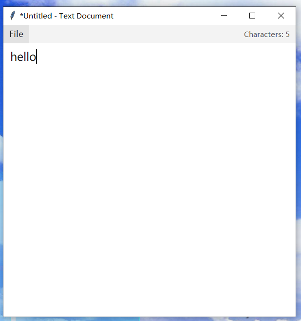

# OCR & Keyboard Record

@S.huaizhong & LaoXia(ark-code-latest)  ·  Version 1.1.4 · [CHANGELOG](./CHANGELOG.md)

[中文](./README.zh-CN.md) · **English**

A lightweight tool for the Windows desktop, providing two main capabilities:

1. **Global screen OCR search** — `Ctrl+Alt+F`
   - One-shot capture of the current screen (multi-monitor supported)
   - Primary engine: RapidOCR (PP-OCRv4); fallback engine: Windows built-in OCR (`winocr`)
   - Real-time text search and per-hit highlighting inside an overlay
   - Selection mode: box-select recognized text fragments and copy them
   - Rescan supported: refresh directly when the page changes, no need to reopen

2. **Keyboard + clipboard input recording** — `Ctrl+Alt+X`
   - Records keyboard input in the background (digits, letters, symbols, and modifier combos)
   - Records clipboard copy events synchronously (togglable)
   - Log appended in JSON Lines format to `memory/keylog/log.jsonl`
   - Panel supports refresh, select-all-copy, clear, and retention-day management
   - **Privacy opt-in by default**: keyboard logging / clipboard watching / Chinese IME capture are all **disabled on first launch** — enable them manually in the panel (see "Privacy" below)

A system tray icon stays resident; the right-click menu can toggle the UI language between Chinese and English.

---

## Screenshots

| Full-screen OCR search | Selection mode | Copy toast |
|---|---|---|
|  |  |  |

| Input-record panel | New text editor | Tray icon & menu |
|---|---|---|
|  |  |  |

<details><summary>English UI variants</summary>

| OCR overlay | Input-record panel | Tray icon & menu |
|---|---|---|
|  |  |  |

</details>

---

## Features

### 1. Full-screen OCR search overlay  `Ctrl+Alt+F`


- One-shot capture of the current screen (multi-monitor + arbitrary DPI supported).
- Type in the search box on the top-left; every hit gets a red bounding box, and the tool jumps between hits with `Enter` / `Shift+Enter`.
- `Rescan` button re-runs OCR on the current shot without closing the overlay.
- `Esc` / right-click / click empty space to dismiss.

### 2. Selection mode  (click `Select` on the overlay toolbar)


- Click each recognized fragment to add it to a pick set (blue outline = selected).
- Bottom-right toast shows the live counter, e.g. `Copy selected (24)`; a single click copies all picks in reading order.
- Great for scraping text off web pages that block right-click / disable text selection.

### 3. Copy toast & freshness feedback


- Whether copying from the OCR overlay, the input-record panel, or via `Copy All`, a small transient toast fades in near the pointer to confirm the copy landed on the clipboard.
- Sibling-loop protection makes sure copies fired by the tool itself never get re-logged into `log.jsonl` (see 1.1.3 fix in [CHANGELOG](./CHANGELOG.md)).

### 4. Input-record panel  `Ctrl+Alt+X`


- Live view of `log.jsonl`: keystrokes, IME commits, and clipboard events rendered in chronological order.
- Special keys are rendered as bracket tags such as `[*Ctrl+V]` `[*←]` `[*Enter]`; clipboard blocks get their own `───[Clipboard ...]───` separators highlighted in yellow.
- Top toolbar: `Reload` · `Copy all` · `Clear` · retention (3 / 7 / 15 days).
- Right-side privacy switches (all **OFF** by default): keyboard log, clipboard watch, Chinese IME capture, plus autostart (normal / elevated).
- Since 1.1.4, history is paged backwards from disk instead of being fully loaded when the panel opens.

### 5. Tray icon & language menu


- Left-click the tray icon = trigger screen OCR; right-click = full menu (Recognize screen / Input history / New text document / Language / Quit).
- Language submenu switches the entire UI + hotkey tooltips + tray menu labels between Chinese and English instantly — no restart needed.

### 6. Built-in text editor


- Open it from `Ctrl+Alt+N` or **New Text Document** in the tray menu.
- Uses the standard Windows title bar, border, native dragging, resizing, minimize, and close behavior.
- Keeps live character count, automatic wrapping, 14-point text, Save, Save As, and unsaved-change confirmation.

---

## Performance

Reference numbers on the author's machine (Intel i7-8700K, 32 GB RAM, RTX 3070, Windows 11, **CPU inference only**):

| Metric | Value |
|---|---|
| Idle RSS (tray resident) | ~60 MB |
| Peak RSS during one OCR pass | ~100 MB |
| 2K screen (2560 × 1440) end-to-end latency | **4– 8 s** from hotkey to overlay |
| 1080p screen (1920 × 1080) end-to-end latency | ~2– 4 s |
| Cold start of RapidOCR (first hotkey after launch) | +0.8 s one-off |
| Log append rate under heavy typing | negligible; each entry is a single JSON line |

No GPU acceleration is used — the whole pipeline runs on the CPU via `onnxruntime`, so a modern quad-core box is enough. If you have a slower CPU the OCR latency grows roughly linearly with pixel count; consider searching a smaller region or scaling down the primary monitor.

---

## Built on

Everything below is Python-only or freely available:

- **OCR**: [RapidOCR](https://github.com/RapidAI/RapidOCR) 1.2.3 (PP-OCRv4 slim ONNX) as the primary engine, [`winocr`](https://pypi.org/project/winocr/) as fallback.
- **Inference runtime**: [`onnxruntime`](https://onnxruntime.ai/) (CPU EP).
- **Image capture**: [Pillow](https://python-pillow.org/) `ImageGrab.grab(all_screens=True)` — no extra native dependency.
- **Keyboard hook**: [`keyboard`](https://pypi.org/project/keyboard/) (uses the Windows `LowLevelKeyboardProc` in the kernel-mode hook layer).
- **IME commit capture**: [`comtypes`](https://pypi.org/project/comtypes/) + [`uiautomation`](https://pypi.org/project/uiautomation/) subscribing to `TextChanged` events (best-effort, optional).
- **Tray icon**: [`pystray`](https://pypi.org/project/pystray/) with a Pillow-rendered icon and a `ctypes`-driven native popup menu.
- **Overlay UI**: standard-library `tkinter` (`tk.Toplevel` with a full-screen transparent canvas).
- **DPI**: `ctypes.windll.shcore.SetProcessDpiAwareness(2)` for correct multi-monitor coordinates.
- **Storage**: JSON Lines in `memory/keylog/log.jsonl` — no database, no cloud, everything stays on the user's disk.

Single file (`screen_search.py`, ~146 KB) drives the whole app; no build step, no service, no auto-updater.

---

## Requirements

- **Python** 3.10 or higher (currently tested on 3.14)
- **Windows** 10 / 11 (relies on Win32 API, `winocr`, DPI awareness)

### One-click install (recommended)

Double-click `setup.bat` at the project root:

- Automatically locates a local Python interpreter (project-specific deploy → `py -3` → `python.exe` on PATH)
- Creates an isolated `.venv/` under the project directory
- Installs all dependencies
- Afterwards `run_screen_search.bat`, `install_autostart.bat`, or any manual launch will automatically pick up `.venv`

### Manual install

```powershell
python -m venv .venv
.venv\Scripts\pip install -r requirements.txt
```

Core dependencies: `Pillow`, `numpy`, `keyboard`, `winocr`, `pystray`, `rapidocr-onnxruntime` (pinned to 1.2.3, which works on Python 3.11–3.14 at runtime even though its installer declares Python ≤ 3.10; `setup.bat` handles the corner case with `--ignore-requires-python` when needed).
Optional dependencies: `comtypes`, `uiautomation` (Chinese IME capture; the corresponding switch is greyed out when they are missing, without impacting other functionality).

`winocr` requires Windows 10 1809 or higher, with the corresponding OCR language pack installed (Chinese by default). RapidOCR automatically downloads the PP-OCRv4 model on first run (~15 MB).

## Running

Silent GUI launch (recommended for daily use):

```
run_screen_search.bat
```

Debug launch with a console (for reading tracebacks):

```
run_screen_search_debug.bat
```

After launch:

- Tray icon: a blank ruled-paper design rendered independently at native sizes from 16 to 64 pixels; left-click triggers screen OCR, while the right-click menu provides OCR, input history, and a new text document
- Global hotkeys: `Ctrl+Alt+F` opens the OCR overlay, `Ctrl+Alt+X` opens the input-record window, and `Ctrl+Alt+N` opens the built-in text editor and brings it to the foreground
- Built-in text editor: standard Windows title bar, border, native shadow, dragging, resizing, minimize, and close behavior; uses the top-right anchor `(2500, 50)` and client size `600×600` at 2K (top-left `(1900, 50)`) as the proportional baseline for 1080p and 4K. The live character count sits in the File toolbar, while a visually 70%-opaque scrollbar floats inside the text area only when scrolling is needed; includes 14-point text, automatic wrapping, Save, Save As, and close confirmation

## Logon autostart

The panel provides **two mutually exclusive autostart switches** (checking one automatically uninstalls the other, so both cannot exist at once), corresponding to two security models:

### Normal autostart (recommended)

- **Task name**: `ScreenSearch_UserOnly_<hash>` (`<hash>` = first 8 chars of the script path SHA1)
- **Privilege level**: current logged-in user (no `/RL HIGHEST`)
- **UAC**: not required
- **Capabilities**: OCR, clipboard watching, keyboard capture for user-level foreground apps
- **How to enable**: in the input-record panel, tick **Autostart (normal)**

### Elevated autostart (high privilege)

- **Task name**: `ScreenSearch_Full_<hash>`
- **Privilege level**: `/RL HIGHEST` (runs as admin token at logon)
- **UAC**: one confirmation required at install time; no confirmation at subsequent logons
- **Capabilities**: everything the normal task can do, plus keyboard capture for windows running elevated
- **How to enable**: in the input-record panel, tick **Autostart (elevated)**; if you are not admin, a dialog will offer to relaunch elevated

### Command-line method (legacy compatibility)

- Run `install_autostart.bat` **as admin** → creates the high-privilege task (legacy name `ScreenSearch`)
- Run `uninstall_autostart.bat` **as admin** → removes the legacy task
- **Recommended: uninstall the legacy task before enabling the new panel-based one**

Task names include a script-path SHA1 suffix — multiple installations on the same host do not clobber each other.

## Directory layout

```
ocr-keyboard-record/
├── screen_search.py            main program (single file)
├── setup.bat                   one-click install (creates .venv + installs deps)
├── run_screen_search.bat       silent launch (prefers .venv)
├── run_screen_search_debug.bat launch with console
├── install_autostart.bat       register logon autostart (prefers .venv)
├── uninstall_autostart.bat     remove logon autostart
├── requirements.txt            dependency manifest
├── README.md                   English documentation (this file)
├── README.zh-CN.md             Chinese documentation
├── CHANGELOG.md                version history
├── LICENSE                     license
├── .venv/                      project-local virtual environment (auto-created by setup.bat, .gitignore-d)
└── memory/
    └── keylog/
        ├── config.json         recorder configuration (auto-generated)
        ├── lang.json           UI language persistence
        └── log.jsonl           keyboard / clipboard log (generated at first run)
```

The `memory/keylog/` directory is resolved relative to `screen_search.py`, so the project never writes to any external workspace.

---

## Data storage location and format

> This project does **not** use system-level directories (like `%APPDATA%` or `%LOCALAPPDATA%`). All runtime files live in `memory/keylog/` next to `screen_search.py`, making backup and migration straightforward.

### File overview

| Path (relative to project) | Content | Format | When written |
|---|---|---|---|
| `memory/keylog/log.jsonl` | Keyboard input + clipboard log | [JSON Lines](https://jsonlines.org/) (one JSON object per line) | Appended continuously while process runs |
| `memory/keylog/config.json` | Retention days and switches | Plain JSON | When the retention policy is modified in the panel |
| `memory/keylog/lang.json` | UI language selection (zh / en) | Plain JSON | When the language is switched from the tray menu |

### `log.jsonl` entry example

Each line is an independent JSON object; main fields:

```jsonl
{"ts": 1783933814.13, "kind": "key",  "text": "@"}
{"ts": 1783933814.38, "kind": "ime",  "text": "你好"}
{"ts": 1783933815.02, "kind": "clip", "text": "copied content"}
{"ts": 1783933816.44, "kind": "key",  "text": "[*Ctrl+C]"}
```

| Field | Meaning |
|---|---|
| `ts` | UNIX timestamp (seconds, with fractional part) |
| `kind` | Event type: `key` normal key or shortcut label / `ime` IME commit (via UI Automation) / `clip` clipboard copy |
| `text` | Event content; shortcuts / special keys are stored as bracket labels like `[*Ctrl+C]` `[*Enter]` (the `[*` prefix avoids collision with normal `[xxx]` syntax found in source code and terminals) |

### Screen OCR data

OCR results from the screen search flow are kept **in memory only** and released when the next OCR pass starts. **Nothing is written to disk.** The PP-OCRv4 model file downloaded on first use of RapidOCR is cached under `~/.rapidocr_onnxruntime/` (public model weights only, no user data).

### Retention and cleanup

- **Automatic expiry cleanup**: default 3 days (configurable in the panel to 3 / 7 / 15 days). Cleanup runs at process startup + on the first append of each day (to avoid long-running sessions missing the midnight rollover). Expired entries are removed in-place when `log.jsonl` is rewritten; no backup is kept.
- **Manual clear**: click the "Clear" button in the input-record panel to delete `log.jsonl` directly (**no backup is kept**).
- **Manual file delete**: you can delete `memory/keylog/log.jsonl` directly; it will be recreated on the next launch.
- **Search / migration**: general text tools (`type`, `Get-Content`, `jq`, etc.) can read `log.jsonl` directly.

### Privacy

**Privacy opt-in by default**: since 1.1.x, keyboard logging / clipboard watching / Chinese IME capture are **all disabled on first launch** and must be enabled manually in the panel. Switch states are stored in `memory/keylog/config.json` (`keylog_enabled` / `clipboard_enabled` / `uia_enabled`), and the tray tooltip shows the current recording state in real time (K / C / IME combo or OFF).

Since 1.1.4, disabling a switch prevents the corresponding clipboard or focused-control content from being read, not merely written to the log. A per-installation single-instance guard also prevents duplicate hooks and duplicate records.

`log.jsonl` stores the **complete local keyboard + clipboard activity** (only when the corresponding switch is on), which may include passwords, private chats, verification codes, and other sensitive information. Please note:

- **Relies solely on local disk isolation.** This project does not send any data to external servers — no cloud sync, no telemetry.
- **Before sharing the project directory** (uploading to cloud drives, sending archives to others, etc.), **manually delete or verify** that `log.jsonl` does not contain sensitive content.
- **The bundled [`.gitignore`](./.gitignore) already excludes `log.jsonl` and its backups**, so `git push` to GitHub etc. will not upload the log file. But you must still handle it during rename / manual copy.
- For long-term archiving, consider moving `log.jsonl` to a protected personal directory (e.g. a BitLocker-encrypted volume).

---

## Known Issues

The issues below are limitations of the current single-file Python architecture, third-party OCR models, and Windows IME internals. Some may be addressed by future major-version rewrites; others are fundamentally out of scope.

### 1. Screen OCR: text lines containing Chinese or spaces exhibit rightward-cumulative highlight offset

**Symptom**: when searching Chinese words or lines containing spaces via `Ctrl+Alt+F`, the highlight boxes may drift character-by-character rightward; the further right, the larger the deviation.

**Technical cause**:

- The primary engine RapidOCR (PP-OCRv4) outputs bounding boxes at the line level, not the character level.
- Its DBNet detector head is not particularly sensitive to Chinese spaces, so real spaces are often dropped — e.g. `给 牢虾 发消息` may be recognized as `给牢虾发消息` (fewer recognized characters than the truth).
- The line-level bbox width still corresponds to the real pixel width including spaces. Any algorithm that "evenly divides the line bbox across recognized text" or "walks per character using physical width" will accumulate rightward offset because character counts do not match.
- Each missing character position offsets subsequent characters by ~3–10 px; over a 20-character line the drift can exceed 60 px.

**Approaches evaluated (none fully resolved)**:

| Approach | Result |
|---|---|
| Line-bbox even split + weighted Chinese/English char partition | Rightward drift persists |
| Row-height-based character-width walk from line start | Drift reduced but still visible |
| Global 1.5× stretch for spaced lines + bbox center anchor | Short words distort, long lines still off |
| Heuristic secondary OCR (2× rescan for suspicious lines only) | Limited hit rate, higher CPU cost |
| Whole-image 2× preprocessing then re-OCR | Space recall improves, but CPU ~4×, memory +~60 MB |

**Possible future directions**:

- Introduce GPU / DirectML acceleration to make whole-image 2× preprocessing the default precision tier
- Adopt the full PP-OCRv4 rec branch that emits character-level bboxes (the current slim ONNX build does not support this)
- Migrate to a heavier OCR engine (full PaddleOCR, TrOCR, etc.) at the cost of initialization time and dependency size

### 2. Input recording: Chinese IME committed text is captured through a best-effort UI Automation path

**Status (since 1.1.1)**: an opt-in UI Automation subscription to `EditControl.TextChanged` has been implemented, and can be enabled via the **Chinese IME capture** switch in the input-record panel. When it works, the log line will look like `{"kind":"ime","text":"你好"}` — the true committed text rather than the raw pinyin. The limitations below still apply to targets outside UI Automation's reach.

**Symptom (when UIA capture is off or unavailable)**: typing "你好" with Microsoft Pinyin, Sogou, QQ, Rime, etc. may show up in the panel as `你hao1好`, `nihao1你好`, or `n h a o 1 你好`. English input is unaffected; IMEs of other languages have not been tested.

**Technical cause**:

- This project uses [`keyboard`](https://pypi.org/project/keyboard/) for keyboard hooks, which relies on the Windows `LowLevelKeyboardProc` kernel-mode hook — this only captures physical key down/up events.
- Windows Chinese IMEs are built on TSF (Text Services Framework) or IMM32 internals. The entire conversion path from pinyin composition to the final commit happens inside the IME process, bypassing the normal keyboard message channel.
- The IME dispatches the commit via `WM_IME_COMPOSITION` / `WM_CHAR` directly to the focused window, and these messages never reach the low-level keyboard hook.
- Consequently, the hook alone only observes pinyin letters (as normal English keypresses) and candidate digits (as selection shortcuts). The final Chinese text has to be reconstructed separately — either via clipboard-adjacent capture or, since 1.1.1, via UI Automation subscribing to `TextChanged` events on focused edit controls.
- The alternative — injecting the target process and hooking `ImmGetCompositionString` / TSF — involves DLL injection and UWP sandbox compatibility issues, and is out of scope for a single-file Python script.

**Coverage gaps of the current UIA implementation**:

- UWP sandboxed apps (Store apps, Widgets) — UIA events blocked by the sandbox
- Custom-drawn input controls that don't expose the standard `Edit` pattern (e.g. VS Code Webviews, some browser extensions, IDE completion popups)
- Games and fullscreen exclusive apps
- Electron / Chromium WebView content without accessibility trees enabled
- Any target where the switch is left disabled by the user (default state)

### 3. Screen OCR: extreme aspect-ratio images may return zero detections

**Symptom**: when the screenshot height is below ~300 px and width above ~2000 px (e.g. system title bars, notification banners), RapidOCR DBNet may return an empty detection set. The `winocr` fallback still works in this case.

**Technical cause**: DBNet's training samples cluster around a limited aspect-ratio range; extreme ratios fall outside its effective envelope. A more general detection model in a future rewrite would mitigate this.

---

## License

MIT License — see [LICENSE](./LICENSE).

## Authors

- **S.huaizhong** — project design and decisions
- **LaoXia (ark-code-latest)** — implementation (OpenClaw agent collaboration)
