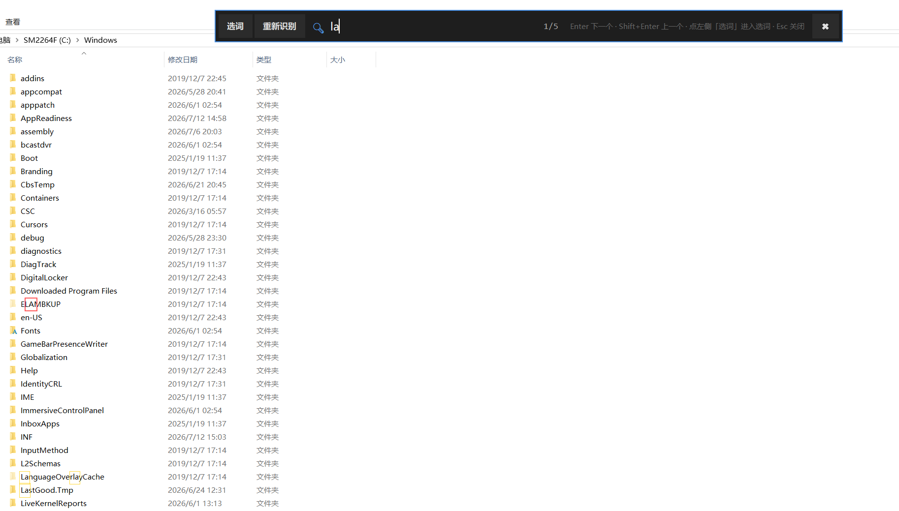
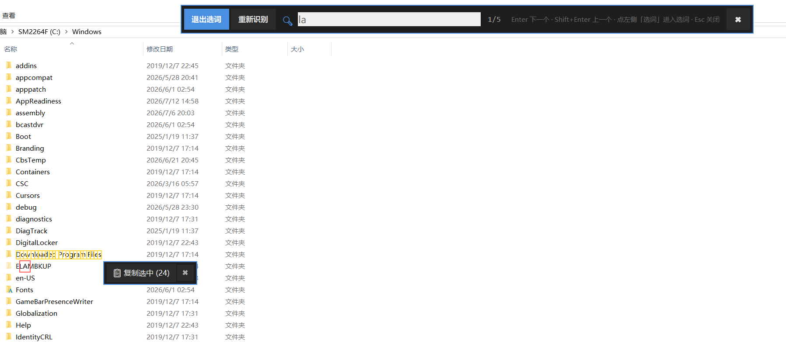
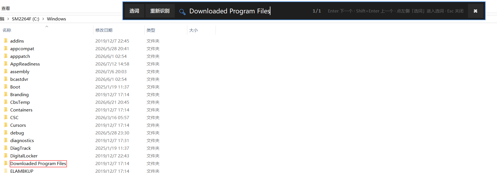
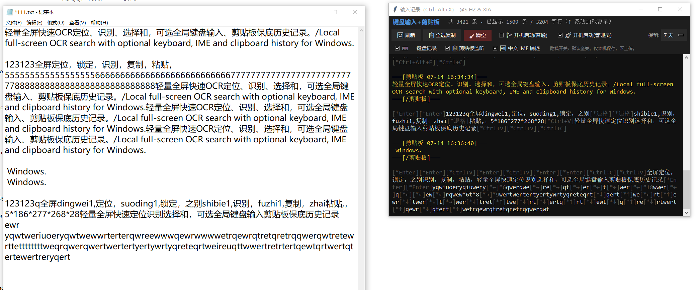
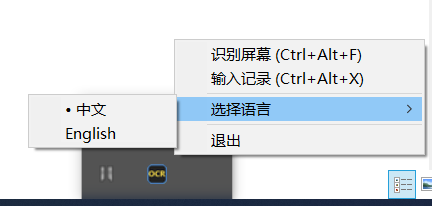
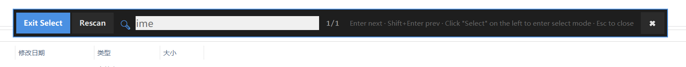
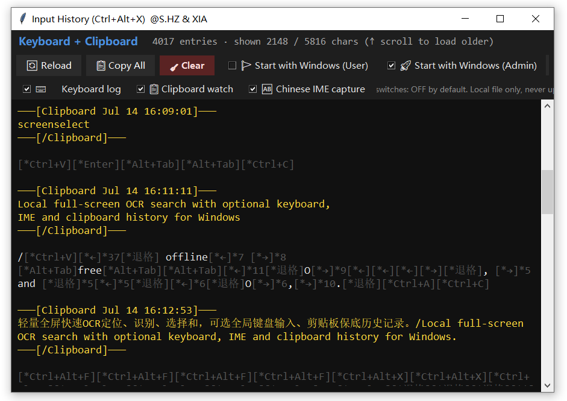
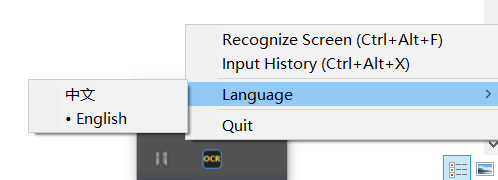

# OCR & Keyboard Record

@S.huaizhong & LaoXia(ark-code-latest)  ·  Version 1.1.3 · [CHANGELOG](./CHANGELOG.md)

**中文** · [English](./README.md)

面向 Windows 桌面的轻量工具，提供两项主要能力：

1. **全局屏幕 OCR 搜索** —— `Ctrl+Alt+F`
   - 一键抓取当前屏幕（支持多显示器）
   - 主引擎为 RapidOCR (PP-OCRv4)，回退引擎为 Windows 内置 OCR (`winocr`)
   - 在覆盖层中实时搜索文本并逐项高亮
   - 支持选词模式：从 OCR 识别结果中框选文本并复制
   - 支持重新识别：页面变化时可直接刷新，无需重新打开

2. **键盘 + 剪贴板输入记录** —— `Ctrl+Alt+X`
   - 后台记录键盘输入（数字、字母、符号及组合键）
   - 同步记录剪贴板复制事件（可关闭）
   - 日志以 JSON Lines 格式追加至 `memory/keylog/log.jsonl`
   - 面板支持刷新、全选复制、清空以及保留天数管理
   - **隐私默认 opt-in**：键盘记录 / 剪贴板监听 / 中文 IME 捕捉首次启动均为关闭，
     需在面板中手动启用（见下方《隐私说明》）

系统托盘图标常驻，右键菜单可切换中英文界面。

---

## 界面截图

| 全屏 OCR 搜索 | 选词模式 | 复制提示 |
|---|---|---|
|  |  |  |

| 输入记录面板 | 托盘图标与右键菜单 |
|---|---|
|  |  |

<details><summary>英文界面变体</summary>

| OCR 搜索栏 | 输入记录面板 | 托盘右键菜单 |
|---|---|---|
|  |  |  |

</details>

---

## 主要功能

### 1. 全屏 OCR 搜索覆盖层　　`Ctrl+Alt+F`


- 一键抓取当前屏幕（多显示器 + 任意 DPI 都支持）。
- 左上角搜索框输入关键词，命中内容红框高亮，`Enter` / `Shift+Enter` 下一项上一项。
- 右侧“重新识别”按钮可在不关闭覆盖层的情况下对当前屏重新跑 OCR。
- `Esc` / 右键 / 点空白处均可关闭。

### 2. 选词模式　　（搜索栏左上角“选词”按钮）


- 逐个点击已识别文本块就能把它们加入选中集（蓝框 = 已选）。
- 右下角实时提示“复制选中(24)”，一键按阅读顺序拼回完整句。
- 特别适合处理那些禁用右键 / 不允许选中的网页内容。

### 3. 复制提示与反馈


- 无论从 OCR 覆盖层、输入记录面板还是“全选复制”触发的复制，都会在鼠标附近弹一下短暂提示，确认内容已入剪贴板。
- 1.1.3 新增循环兄弟防线：本工具自己写入剪贴板的内容，不会反向记回 log.jsonl（详情见 [CHANGELOG](./CHANGELOG.md)）。

### 4. 输入记录面板　　`Ctrl+Alt+X`


- 实时展示 `log.jsonl` ：键盘、IME 提交、剪贴板事件按时间排列。
- 特殊键以 `[*Ctrl+V]` `[*←]` `[*Enter]` 形式展示；剪贴板块使用 `───[剪贴板 ...]───` 分隔并黄色高亮。
- 顶部工具栏：`刷新` · `全选复制` · `清空` · 保留天数（3 / 7 / 15）。
- 右侧隐私开关（默认全部 **关闭**）：键盘记录 / 剪贴板监听 / 中文 IME 捕获，以及开机自启（普通 / 管理员）。

### 5. 托盘图标与语言切换


- 托盘图标左键 = 触发屏幕 OCR；右键 = 完整菜单（识别屏幕 / 输入记录 / 选择语言 / 退出）。
- “选择语言”子菜单即时切换整个界面 + 快捷键提示 + 托盘菜单标签的中英文，无需重启。

---

## 性能参考

以下数据基于作者主机（Intel i7-8700K、32 GB 内存、RTX 1080、Windows 10，**仅 CPU 推理**）：

| 指标 | 数值 |
|---|---|
| 托盘常驻内存 | 约 60 MB |
| OCR 执行时峰值内存 | 约 100 MB |
| 2K 屏幕（2560 × 1440）从快捷键到覆盖层 | **4– 8 s** |
| 1080p 屏幕（1920 × 1080）从快捷键到覆盖层 | 约 2– 4 s |
| RapidOCR 首次启动额外开销 | 一次性 +0.8 s |
| 密集敲字写入 log | 可忽略；每条只是一行 JSON |

**全程不使用 GPU**，全部依靠 CPU + `onnxruntime`，四核新一点的 x86 CPU 就够。CPU 较弱时 OCR 延时会随像素量线性上升，可以选择屏幕区域或降主屏分辨率缓解。

---

## 技术栈

全部基于 Python 生态的免费开源组件：

- **OCR**：[RapidOCR](https://github.com/RapidAI/RapidOCR) 1.2.3（PP-OCRv4 slim ONNX）主引擎，[`winocr`](https://pypi.org/project/winocr/) 作回退。
- **推理运行时**：[`onnxruntime`](https://onnxruntime.ai/)（CPU EP）。
- **图像抓取**：[Pillow](https://python-pillow.org/) `ImageGrab.grab(all_screens=True)`，无额外原生依赖。
- **键盘钩子**：[`keyboard`](https://pypi.org/project/keyboard/)（底层使用 Windows 内核级 `LowLevelKeyboardProc`）。
- **IME 捕获**：[`comtypes`](https://pypi.org/project/comtypes/) + [`uiautomation`](https://pypi.org/project/uiautomation/) 订阅 `TextChanged` 事件（可选、尽力而为）。
- **托盘**：[`pystray`](https://pypi.org/project/pystray/) + Pillow 现场绘制图标 + `ctypes` 驱动的原生弹出菜单。
- **覆盖层 UI**：标准库 `tkinter`（全屏透明 `tk.Toplevel` + 大 canvas）。
- **DPI**：`ctypes.windll.shcore.SetProcessDpiAwareness(2)`，多显示器坐标自活。
- **存储**：JSON Lines 写到 `memory/keylog/log.jsonl`，无数据库、无云、全部本地。

全部逻辑只在一个 `screen_search.py`（约 146 KB）里，无需构建、无守护服务、无自动更新。

---

## 依赖

- **Python** 3.10 或更高（当前基于 3.14 测试）
- **Windows** 10 / 11（依赖 Win32 API、`winocr` 及 DPI 感知）

### 一键安装（推荐）

双击项目根目录的 `setup.bat`：

- 自动搜索本机 Python（优先项目专用部署 → `py -3` → `PATH 中的 python.exe`）
- 在项目目录下创建隔离的 `.venv/`
- 自动安装全部依赖
- 之后无论 `run_screen_search.bat` 、 `install_autostart.bat` 还是手动启动，都会自动命中 `.venv`

### 手动安装

```powershell
python -m venv .venv
.venv\Scripts\pip install -r requirements.txt
```

核心依赖：`Pillow`、`numpy`、`keyboard`、`winocr`、`pystray`、`rapidocr-onnxruntime`（锁死 1.2.3；虽然安装器声明支持 Python ≤ 3.10，但运行时可在 3.11–3.14 上正常工作；`setup.bat` 在必要时会用 `--ignore-requires-python` 兜底）。
可选依赖：`comtypes`、`uiautomation`（中文 IME 捕捉；不安装时该开关自动置灰，不影响其他功能）。

`winocr` 需要 Windows 10 1809 及以上版本，并已安装对应语言的 OCR 语言包（默认中文）。RapidOCR 首次运行时会自动下载 PP-OCRv4 模型（约 15 MB）。

## 运行

图形静默启动（推荐日常使用）：

```
run_screen_search.bat
```

带控制台调试（用于查看错误堆栈）：

```
run_screen_search_debug.bat
```

启动后：

- 托盘图标：左键触发屏幕 OCR，右键弹出菜单
- 全局热键：`Ctrl+Alt+F` 打开 OCR 覆盖层，`Ctrl+Alt+X` 打开输入记录窗口

## 登录自启

面板中提供 **两个互斥的自启开关**（任一个勾选时自动卸载另一个，不会同时存在），对应不同的安全模型：

### 普通启动（推荐）

- **任务名**：`ScreenSearch_UserOnly_<hash>`（`<hash>` 为脚本路径 SHA1 前 8 位）
- **权限级别**：当前登录用户（不使用 `/RL HIGHEST`）
- **UAC**：不需要
- **能力范围**：OCR、剪贴板监听、面向当前用户级应用的键盘记录
- **使用方式**：在输入记录面板中勾选 **开机启动(普通)**

### 管理员启动（高权限）

- **任务名**：`ScreenSearch_Full_<hash>`
- **权限级别**：`/RL HIGHEST`（登录后以管理员令牌运行）
- **UAC**：首次安装时需要一次确认；后续登录无需确认
- **能力范围**：与普通启动相同，额外能够监听以管理员运行的目标窗口的键盘输入
- **使用方式**：在输入记录面板中勾选 **开机启动(管理员)**；非管理员时会弹窗提示以管理员重启

### 命令行方式（兼容旧版本）

- 以管理员运行 `install_autostart.bat` → 创建高权限任务（旧名 `ScreenSearch`）
- 以管理员运行 `uninstall_autostart.bat` → 删除旧名任务
- **推荐先卸载旧任务**后再从面板开启新任务

任务名含脚本路径 SHA1 后缀——同一主机上多份安装不会相互覆盖。

## 目录结构

```
ocr-keyboard-record/
├── screen_search.py            主程序（单文件）
├── setup.bat                   一键安装（建 .venv + 装依赖）
├── run_screen_search.bat       静默启动（优先使用 .venv）
├── run_screen_search_debug.bat 带控制台启动
├── install_autostart.bat       注册开机自启（优先使用 .venv）
├── uninstall_autostart.bat     卸载开机自启
├── requirements.txt            依赖清单
├── README.md                   英文文档
├── README.zh-CN.md             中文文档（本文件）
├── CHANGELOG.md                版本记录
├── LICENSE                     许可证
├── .venv/                      项目专用虚拟环境（setup.bat 自动创建，已入 .gitignore）
└── memory/
    └── keylog/
        ├── config.json         记录器配置（自动生成）
        ├── lang.json           界面语言持久化
        └── log.jsonl           键盘 / 剪贴板日志（首次运行时生成）
```

`memory/keylog/` 目录相对于 `screen_search.py` 所在目录解析，独立项目不会向外部工作区写入。

---

## 数据存储位置与格式

> 本项目 **不使用**系统级目录（如 `%APPDATA%`、`%LOCALAPPDATA%`）。所有运行时文件均存放在与 `screen_search.py` 同级的 `memory/keylog/` 目录，便于备份与迁移。

### 文件一览表

| 路径（相对于项目目录） | 内容 | 格式 | 写入时机 |
|---|---|---|---|
| `memory/keylog/log.jsonl` | 键盘输入 + 剪贴板日志 | [JSON Lines](https://jsonlines.org/)（每行一个 JSON 对象） | 进程运行时持续追写 |
| `memory/keylog/config.json` | 日志保留天数等配置 | 普通 JSON | 面板中修改保留策略时 |
| `memory/keylog/lang.json` | 界面语言选择（zh / en） | 普通 JSON | 托盘菜单切换语言时 |

### `log.jsonl` 条目示例

每行一个独立 JSON 对象，主要字段：

```jsonl
{"ts": 1783933814.13, "kind": "key",  "text": "@"}
{"ts": 1783933814.38, "kind": "ime",  "text": "你好"}
{"ts": 1783933815.02, "kind": "clip", "text": "复制的内容"}
{"ts": 1783933816.44, "kind": "key",  "text": "[*Ctrl+C]"}
```

| 字段 | 含义 |
|---|---|
| `ts` | UNIX 时间戳（秒，含小数） |
| `kind` | 事件类型：`key` 普通按键与快捷键标签 / `ime` 输入法上屏（UI Automation 捕捉） / `clip` 剪贴板复制 |
| `text` | 事件对应的文本内容；快捷键 / 特殊键存为 `[*Ctrl+C]` `[*Enter]` 等方括号标签（`[*` 前缀避免与源代码里的普通 `[xxx]` 语法混淆） |

### 屏幕 OCR 数据

屏幕搜索过程中的 OCR 识别结果仅保留在**内存**，下一次 OCR 开始时自动释放。**不会写入磁盘**。RapidOCR 首次使用时下载的 PP-OCRv4 模型文件缓存在用户主目录下 `~/.rapidocr_onnxruntime/`（仅含公共模型权重，不含用户数据）。

### 保留与清理

- **自动满期清理**：默认保留 3 天（可在面板中调为 3 / 7 / 15 天）。清理触发时机：进程启动时一次 + 每天首次追写时自动执行（为避免长时间开机的进程错过零点切日）。过期条目就地重写 `log.jsonl` 时删除，不作备份。
- **手动清空**：在输入记录面板中点击"清空"按钮，会直接删除 `log.jsonl`（**不保留备份**）。
- **手动删除文件**：可直接删除 `memory/keylog/log.jsonl`，下次启动时自动重建。
- **搜索 / 迁移**：使用一般文本工具（`type`、`Get-Content`、`jq`等）即可直接读取 `log.jsonl`。

### 隐私说明

**隐私默认 opt-in**：自 1.1.x 起，键盘记录 / 剪贴板监听 / 中文 IME 捕捉 **三项开关首次启动均为关闭**，需在面板手动开启。开关状态保存在 `memory/keylog/config.json`（`keylog_enabled` / `clipboard_enabled` / `uia_enabled`），并在系统托盘工具提示中实时显示当前录制状态（K / C / IME 组合或 OFF）。

`log.jsonl` 存储的是**完整的本地键盘 + 剪贴板活动**（仅当对应开关开启时），可能包含密码、私人聊天、验证码等敏感信息。请注意：

- **仅依靠本地盘隔离**。本项目不向任何外部服务器发送数据，无云同步、无遥测。
- **共享项目目录**（包括上传云盘、向他人发送压缩包等）**前请手动删除或验证** `log.jsonl` 不含敏感内容。
- **项目自带的 [`.gitignore`](./.gitignore) 已排除 `log.jsonl` 及其备份**，使用 `git push` 同步到 GitHub 等代码仓库时，不会上传日志文件。但重命名 / 手动拷贝时仍需处理。
- 如需长期存档，建议将 `log.jsonl` 移至受保护的个人目录（如 BitLocker 加密卷）。

---

## 已知问题 (Known Issues)

以下问题受限于第三方模型、系统 API 及输入法内部实现，**在 1.0.0 版本无法从本项目层完全修复**，将作为遗留项进入 1.1.x 迭代。

### 1. 屏幕 OCR：包含中文或空格的文本行，高亮框存在向右累积偏移

**现象**：使用 `Ctrl+Alt+F` 搜索中文词或含空格的文本行时，高亮框可能自左向右逐字偏移，越靠右偏差越明显。

**技术原因**：

- 主引擎 RapidOCR (PP-OCRv4) 以整行为粒度输出 bbox，未提供字符级坐标。
- 其 DBNet 检测头对中文空格敏感度较低，容易将真实的空格丢失。例如原文 `给 牢虾 发消息` 可能被识别为 `给牢虾发消息`（识别字符数少于真实字符数）。
- 行级 bbox 宽度仍对应含空格的真实像素宽度。任何"按识别文本均分行 bbox"或"按字符物理宽度递推"的算法都会因字符数不匹配而在右侧累积偏移。
- 每丢失一个字符位，每字偏移约 3–10 像素；一行 20 字的偏差可累积至 60 像素以上。

**已评估方案（在 1.0.0 内均未能彻底解决）**：

| 方案 | 结果 |
|---|---|
| 行 bbox 均分 + 中英字符权重切分 | 存在右向偏移 |
| 按行高的物理字宽自行首递推 | 偏移减小但仍存在 |
| 含空格行整体拉伸 1.5× + bbox 中心锚点 | 短词变形，长行仍不准确 |
| 启发式二次识别（仅对可疑行执行 2× 放大重扫） | 命中率有限，CPU 开销上升 |
| 整图 2× 预处理后重新 OCR | 空格召回率上升，但 CPU 开销约 4 倍，内存增加约 60 MB |

**后续方向（1.1.x 候选）**：

- 引入 GPU / DirectML 加速，将整图 2× 预处理作为默认精度档
- 接入可输出字符级 bbox 的完整 PP-OCRv4 rec 分支（当前 ONNX 精简版不支持）
- 迁移至重量级 OCR 引擎（完整版 PaddleOCR、TrOCR 等），代价为初始化时间与依赖体积上升

### 2. 输入记录：中文输入法下无法获取真实上屏文本，仅能捕获拼音 + 选字数字 + 最终结果

**现象**：使用微软拼音、搜狗、QQ、Rime 等中文输入法输入"你好"时，输入记录面板可能显示为 `你hao1好`、`nihao1你好` 或 `n h a o 1 你好` 等混合形式。英文输入不受影响；其他语种输入法尚未测试。

**技术原因**：

- 本项目使用 [`keyboard`](https://pypi.org/project/keyboard/) 库进行键盘监听，其底层依赖 Windows `LowLevelKeyboardProc` 内核级 hook，仅能捕获物理按键的按下与释放事件。
- Windows 中文输入法基于 TSF (Text Services Framework) 或 IMM32 内部接口工作。拼音预输入串到最终上屏字的整个转换过程发生在输入法进程内部，不经过常规键盘消息通道。
- 输入法执行上屏时通过 `WM_IME_COMPOSITION` / `WM_CHAR` 消息直接投递到当前焦点窗口，这些消息不会触达内核级键盘 hook。
- 因此 hook 只能观测到拼音字母（作为普通英文按键）与候选数字（作为选字快捷键），最终中文则通过剪贴板或焦点窗口另行捕获，三部分拼接后即形成前述混合串。
- 若需正确获取上屏文本，需注入目标进程并 hook `ImmGetCompositionString` 或 TSF 接口，或使用 UI Automation 监听 `EditControl.TextChanged` 事件。前者涉及 DLL 注入及 UWP 沙盒兼容性问题；后者对沙盒进程、游戏及部分自绘输入框失效。两种方案均超出当前单文件 Python 脚本的架构承载范围。

**后续方向（1.1.x 候选）**：

- 追加 UI Automation 监听 `EditControl.TextChanged`，用于补正主流原生 Win32 输入框中的中文上屏
- 使用 `pywinauto` 或 `comtypes` 通过 IAccessible2 获取光标附近文本增量
- 无法覆盖的场景：UWP 沙盒应用、部分自绘控件（例如 VS Code Webview、部分浏览器扩展）

### 3. 屏幕 OCR：极端宽高比图像可能出现零检测

**现象**：当截图高度小于约 300 像素、宽度大于约 2000 像素时（例如系统顶栏、通知横条），RapidOCR DBNet 可能返回空检测。此时 `winocr` 回退分支仍可正常识别。

**技术原因**：DBNet 训练样本的宽高比分布相对集中，极端比例超出其适用区间。1.1.x 中若引入更通用的检测模型，该问题将得到缓解。

---

## 许可

MIT License — 详见 [LICENSE](./LICENSE)。

## 作者

- **S.huaizhong** — 项目设计与决策
- **LaoXia (ark-code-latest)** — 实现（OpenClaw agent 协作）
